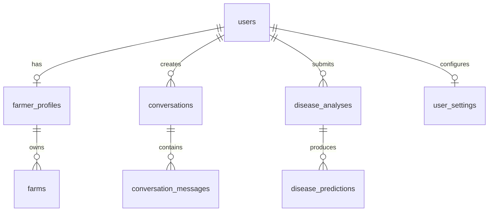

<p align="center">
  
</p>

<h1 align="center">🌾 HarvestLink</h1>

<p align="center">
  <strong>AI-Powered Bilingual Agricultural Assistant for Farmers</strong><br/>
  <em>Farmer speaks → HarvestLink understands → retrieves real data → responds in Tamil or English</em>
</p>

<p align="center">
  
  
  
  
  
  
  
</p>

---

## Table of Contents

- [Overview](#overview)
- [Key Features](#key-features)
- [Architecture](#architecture)
- [Tech Stack](#tech-stack)
- [Project Structure](#project-structure)
- [Prerequisites](#prerequisites)
- [Environment Variables](#environment-variables)
- [Supabase Setup](#supabase-setup)
- [Backend Setup (FastAPI)](#backend-setup-fastapi)
- [Frontend Setup (Flutter)](#frontend-setup-flutter)
- [AI Pipeline Configuration](#ai-pipeline-configuration)
- [Disease Detection Model](#disease-detection-model)
- [API Documentation](#api-documentation)
- [Database Schema](#database-schema)
- [Testing](#testing)
- [Deployment](#deployment)
- [Development Roadmap](#development-roadmap)
- [Contributing](#contributing)
- [License](#license)

---

## Overview

**HarvestLink** is a production-grade mobile application designed to serve as an intelligent agricultural companion for farmers in Tamil Nadu, India. The application enables farmers to interact through **natural voice conversations** in **Tamil** or **English**, ask questions about dams, weather, crops, and market prices, and receive real answers drawn from live data sources — not hard-coded values.

The application also features an **AI-powered crop disease detection** system that analyzes photographs of affected leaves using a real computer-vision model and returns possible diseases, confidence scores, and recommended actions — all explained in the farmer's preferred language.

### Core Experience

```
Farmer speaks (Tamil/English)
        ↓
Speech-to-Text
        ↓
AI Intent Classification
        ↓
Tool Orchestration (Dam / Weather / Crop / Disease / Market)
        ↓
Real Data Retrieval (APIs, ML Models, Database)
        ↓
AI Response Generation (in farmer's language)
        ↓
Text-to-Speech Playback
```

### Who Is This For?

| User         | Description                                                                 |
|--------------|-----------------------------------------------------------------------------|
| **Farmers**  | Primary users — interact via voice, get agricultural intelligence           |
| **Consumers**| Browse local farms, pre-order produce (future milestone)                    |
| **Admins**   | Manage data sources, monitor system health (future milestone)               |

---

## Key Features

### 🎙️ Bilingual Voice Assistant
- Natural voice interaction in **Tamil** and **English**
- Real-time speech-to-text and text-to-speech
- Conversational context maintained across turns
- Intent-based AI tool routing (not raw LLM passthrough)

### 📷 Crop Disease Detection
- Camera capture or gallery upload
- Image quality validation before analysis
- Real ML model inference (TensorFlow/TFLite)
- Confidence-aware predictions with safety disclaimers
- Full disease report with symptoms and recommended actions
- Results spoken aloud in Tamil or English

### 💧 Dam & Reservoir Information
- Live data from official sources (India-WRIS, TN Water Resources Dept, CWC)
- Storage levels, inflow/outflow, water levels, last-updated timestamps
- Abstracted `DamDataProvider` — data source is swappable

### 🌦️ Weather Intelligence
- Current conditions, forecasts, rainfall probability, severe alerts
- Location-aware (GPS or manual selection)
- Integration with OpenWeatherMap / India Meteorological Department

### 🌱 Crop Information & Recommendations
- Crop details, growing seasons, soil requirements
- Context-aware recommendations based on farmer profile, location, weather, and water availability

### 👤 Farmer Profile & Onboarding
- Language selection during onboarding
- Profile: location, farm size, soil type, water source, primary crops
- Progressive profile completion (not all fields required upfront)

### 🔒 Security & Authentication
- Supabase Auth (email/phone OTP)
- Row Level Security on all tables
- No API keys in client code — backend proxies all sensitive calls
- HTTPS, input validation, rate limiting

### 📴 Offline Support
- Cached dam data, crop info, conversations, disease information
- Clear staleness indicators ("Last updated 2 hours ago")
- Graceful degradation with friendly error messages

---

## Architecture

```
┌─────────────────────────────────────────────────────────────────────┐
│                         FLUTTER MOBILE APP                         │
│                                                                     │
│  ┌──────────┐  ┌──────────┐  ┌──────────┐  ┌──────────┐           │
│  │  Voice    │  │  Disease  │  │  Home    │  │ Profile  │           │
│  │  Screen   │  │  Scanner  │  │  Screen  │  │ Screen   │           │
│  └────┬─────┘  └────┬─────┘  └────┬─────┘  └────┬─────┘           │
│       │              │              │              │                 │
│  ┌────▼──────────────▼──────────────▼──────────────▼─────┐         │
│  │              Service Layer (Riverpod)                  │         │
│  │  STT │ TTS │ API Client │ Auth │ Cache │ Image        │         │
│  └──────────────────────┬────────────────────────────────┘         │
└─────────────────────────┼───────────────────────────────────────────┘
                          │ HTTPS
                          ▼
┌─────────────────────────────────────────────────────────────────────┐
│                       FASTAPI BACKEND                               │
│                                                                     │
│  ┌──────────────────────────────────────────────────────────┐      │
│  │                    API Gateway (v1)                       │      │
│  │  /auth  /assistant  /voice  /dams  /weather  /disease    │      │
│  └───────────────────────┬──────────────────────────────────┘      │
│                          │                                          │
│  ┌───────────────────────▼──────────────────────────────────┐      │
│  │              AI ORCHESTRATION ENGINE                      │      │
│  │                                                           │      │
│  │  Intent Classifier ──► Tool Router ──► Response Generator │      │
│  │                                                           │      │
│  │  Tools:                                                   │      │
│  │    get_dam_details()      get_weather()                   │      │
│  │    get_crop_information() get_market_price()              │      │
│  │    analyze_crop_disease() get_crop_recommendation()       │      │
│  │    get_farmer_profile()   general_agriculture_question()  │      │
│  └──┬──────────┬──────────┬──────────┬───────────────────────┘      │
│     │          │          │          │                               │
│     ▼          ▼          ▼          ▼                               │
│  ┌──────┐  ┌──────┐  ┌──────┐  ┌──────────┐                       │
│  │Gemini│  │ Dam  │  │Weather│  │ Disease  │                       │
│  │ API  │  │ API  │  │  API  │  │ ML Model │                       │
│  └──────┘  └──────┘  └──────┘  └──────────┘                       │
│                                                                     │
└─────────────────────────┼───────────────────────────────────────────┘
                          │
                          ▼
┌─────────────────────────────────────────────────────────────────────┐
│                        SUPABASE                                     │
│                                                                     │
│  ┌──────────────┐  ┌──────────────┐  ┌──────────────┐             │
│  │  PostgreSQL   │  │   Auth       │  │   Storage    │             │
│  │  (RLS)        │  │  (JWT/OTP)   │  │  (Images)    │             │
│  └──────────────┘  └──────────────┘  └──────────────┘             │
└─────────────────────────────────────────────────────────────────────┘
```

### Data Flow: Voice Query

```
1. Farmer taps 🎙️ and speaks Tamil
2. Flutter captures audio → platform STT → Tamil text
3. Text sent to POST /api/v1/assistant/query
4. AI Orchestration:
   a. Language detected: Tamil
   b. Intent classified: DAM_DETAILS
   c. Entity extracted: dam=Mettur
   d. Tool called: get_dam_details("Mettur")
   e. Real data retrieved from DamDataProvider
   f. Gemini generates Tamil response using real data
5. Response returned to Flutter
6. Text displayed + Tamil TTS playback
```

### Data Flow: Disease Detection

```
1. Farmer taps 📷 → Camera/Gallery
2. Image captured → preview → quality check
3. Compressed image uploaded to Supabase Storage
4. POST /api/v1/disease/analyze with image reference
5. Disease ML model runs inference
6. Prediction: { crop: "Tomato", disease: "Early Blight", confidence: 0.91 }
7. Gemini generates explanation in farmer's language
8. Result displayed with Listen 🔊 button
```

---

## Tech Stack

| Layer              | Technology                          | Purpose                                    |
|--------------------|-------------------------------------|--------------------------------------------|
| **Mobile App**     | Flutter (Dart)                      | Cross-platform UI, camera, audio           |
| **State Mgmt**     | Riverpod                            | Reactive, testable state management        |
| **Backend API**    | FastAPI (Python 3.11+)              | REST API, AI orchestration, tool routing   |
| **Database**       | Supabase PostgreSQL                 | Relational data with Row Level Security    |
| **Authentication** | Supabase Auth                       | JWT, email/phone OTP                       |
| **File Storage**   | Supabase Storage                    | Crop images, secure authenticated uploads  |
| **AI / LLM**       | Google Gemini API                   | Intent detection, response generation      |
| **Speech-to-Text** | Platform STT (Android/iOS native)   | Tamil & English voice recognition          |
| **Text-to-Speech** | Platform TTS (Android/iOS native)   | Tamil & English voice synthesis            |
| **Disease ML**     | TensorFlow / TFLite                 | Crop disease image classification          |
| **Weather API**    | OpenWeatherMap                      | Current weather, forecasts, alerts         |
| **Dam Data**       | India-WRIS / TN WRD / CWC          | Live reservoir levels and statistics       |
| **Caching**        | Hive (Flutter) + Redis (Backend)    | Offline support, response caching          |
| **Logging**        | Structlog (Python)                  | Structured production logging              |
| **Testing**        | pytest, Flutter test, integration   | Unit, API, widget, and E2E tests           |

---

## Project Structure

```
harvestlink/
│
├── README.md                          # This file
├── ARCHITECTURE.md                    # Detailed architecture documentation
├── API_DOCUMENTATION.md               # Full API reference
├── DATABASE.md                        # Schema documentation
├── DEPLOYMENT.md                      # Production deployment guide
├── ENVIRONMENT.md                     # Environment variable reference
├── AI_PIPELINE.md                     # AI orchestration details
├── DISEASE_MODEL.md                   # ML model documentation
├── LICENSE                            # MIT License
│
├── backend/                           # FastAPI Backend
│   ├── app/
│   │   ├── main.py                    # Application entrypoint
│   │   ├── config.py                  # Settings & environment loading
│   │   │
│   │   ├── api/
│   │   │   └── v1/
│   │   │       ├── auth.py            # Authentication endpoints
│   │   │       ├── assistant.py       # AI assistant query endpoint
│   │   │       ├── voice.py           # Voice processing endpoints
│   │   │       ├── dams.py            # Dam information endpoints
│   │   │       ├── weather.py         # Weather endpoints
│   │   │       ├── disease.py         # Disease detection endpoints
│   │   │       ├── crops.py           # Crop information endpoints
│   │   │       └── farmer.py          # Farmer profile endpoints
│   │   │
│   │   ├── core/
│   │   │   ├── security.py            # Auth middleware, JWT validation
│   │   │   ├── database.py            # Supabase client initialization
│   │   │   ├── logging.py             # Structured logging setup
│   │   │   └── exceptions.py          # Custom exception handlers
│   │   │
│   │   ├── services/
│   │   │   ├── ai_orchestrator.py     # Intent classification + tool routing
│   │   │   ├── intent_classifier.py   # NLU intent detection
│   │   │   ├── response_generator.py  # LLM response formulation
│   │   │   ├── dam_service.py         # DamDataProvider abstraction
│   │   │   ├── weather_service.py     # Weather API integration
│   │   │   ├── disease_service.py     # DiseaseDetectionService
│   │   │   ├── crop_service.py        # Crop information service
│   │   │   ├── conversation_service.py# Context & history management
│   │   │   └── language_service.py    # Translation & language utilities
│   │   │
│   │   ├── models/
│   │   │   ├── schemas.py             # Pydantic request/response models
│   │   │   ├── database_models.py     # Database table models
│   │   │   └── enums.py               # Shared enumerations
│   │   │
│   │   ├── ml/
│   │   │   ├── disease_model.py       # TF/TFLite model loader & inference
│   │   │   ├── preprocessing.py       # Image preprocessing pipeline
│   │   │   └── models/                # Trained model files (.tflite, .h5)
│   │   │
│   │   └── providers/
│   │       ├── dam_provider.py        # India-WRIS / CWC data provider
│   │       ├── weather_provider.py    # OpenWeatherMap provider
│   │       └── market_provider.py     # Market price data provider
│   │
│   ├── tests/
│   │   ├── test_auth.py
│   │   ├── test_assistant.py
│   │   ├── test_dams.py
│   │   ├── test_weather.py
│   │   ├── test_disease.py
│   │   ├── test_intent_classifier.py
│   │   ├── test_ai_orchestrator.py
│   │   └── conftest.py                # Shared fixtures
│   │
│   ├── alembic/                       # Database migrations (if needed)
│   ├── requirements.txt
│   ├── requirements-dev.txt
│   ├── Dockerfile
│   ├── docker-compose.yml
│   └── .env.example
│
├── frontend/                          # Flutter Mobile App
│   ├── lib/
│   │   ├── main.dart                  # App entrypoint
│   │   │
│   │   ├── core/
│   │   │   ├── constants/
│   │   │   │   ├── app_constants.dart
│   │   │   │   ├── api_endpoints.dart
│   │   │   │   └── asset_paths.dart
│   │   │   ├── theme/
│   │   │   │   ├── app_theme.dart
│   │   │   │   ├── app_colors.dart
│   │   │   │   └── app_text_styles.dart
│   │   │   ├── network/
│   │   │   │   ├── api_client.dart
│   │   │   │   ├── api_interceptor.dart
│   │   │   │   └── network_info.dart
│   │   │   ├── storage/
│   │   │   │   ├── local_storage.dart
│   │   │   │   └── secure_storage.dart
│   │   │   └── utils/
│   │   │       ├── image_utils.dart
│   │   │       ├── permission_utils.dart
│   │   │       └── validators.dart
│   │   │
│   │   ├── features/
│   │   │   ├── auth/
│   │   │   │   ├── data/              # Repository implementations
│   │   │   │   ├── domain/            # Entities, repository interfaces
│   │   │   │   └── presentation/      # Screens, widgets, providers
│   │   │   │
│   │   │   ├── onboarding/
│   │   │   │   └── presentation/
│   │   │   │       └── language_selection_screen.dart
│   │   │   │
│   │   │   ├── home/
│   │   │   │   └── presentation/
│   │   │   │       ├── home_screen.dart
│   │   │   │       └── widgets/
│   │   │   │
│   │   │   ├── assistant/
│   │   │   │   ├── data/
│   │   │   │   ├── domain/
│   │   │   │   └── presentation/
│   │   │   │       ├── assistant_screen.dart
│   │   │   │       └── widgets/
│   │   │   │           ├── voice_button.dart
│   │   │   │           ├── chat_bubble.dart
│   │   │   │           └── listening_indicator.dart
│   │   │   │
│   │   │   ├── voice/
│   │   │   │   ├── data/
│   │   │   │   │   ├── stt_service.dart
│   │   │   │   │   └── tts_service.dart
│   │   │   │   └── domain/
│   │   │   │
│   │   │   ├── disease_detection/
│   │   │   │   ├── data/
│   │   │   │   ├── domain/
│   │   │   │   └── presentation/
│   │   │   │       ├── disease_scan_screen.dart
│   │   │   │       ├── image_preview_screen.dart
│   │   │   │       └── disease_result_screen.dart
│   │   │   │
│   │   │   ├── dams/
│   │   │   │   ├── data/
│   │   │   │   ├── domain/
│   │   │   │   └── presentation/
│   │   │   │
│   │   │   ├── weather/
│   │   │   │   ├── data/
│   │   │   │   ├── domain/
│   │   │   │   └── presentation/
│   │   │   │
│   │   │   ├── crops/
│   │   │   │   ├── data/
│   │   │   │   ├── domain/
│   │   │   │   └── presentation/
│   │   │   │
│   │   │   ├── profile/
│   │   │   │   ├── data/
│   │   │   │   ├── domain/
│   │   │   │   └── presentation/
│   │   │   │
│   │   │   └── settings/
│   │   │       └── presentation/
│   │   │           └── settings_screen.dart
│   │   │
│   │   ├── shared/
│   │   │   ├── widgets/
│   │   │   │   ├── loading_indicator.dart
│   │   │   │   ├── error_widget.dart
│   │   │   │   ├── offline_banner.dart
│   │   │   │   └── listen_button.dart
│   │   │   ├── models/
│   │   │   │   └── api_response.dart
│   │   │   └── l10n/
│   │   │       ├── app_en.arb
│   │   │       └── app_ta.arb
│   │   │
│   │   └── app.dart                   # MaterialApp / Router setup
│   │
│   ├── test/
│   │   ├── features/
│   │   ├── shared/
│   │   └── core/
│   │
│   ├── android/
│   ├── ios/
│   ├── assets/
│   │   ├── images/
│   │   ├── icons/
│   │   └── fonts/
│   ├── pubspec.yaml
│   └── .env.example
│
├── docs/
│   ├── assets/
│   │   └── harvestlink-logo.png
│   ├── screenshots/
│   └── api/
│
├── ml/                                # ML Model Training (separate)
│   ├── notebooks/
│   │   └── disease_detection_training.ipynb
│   ├── data/
│   ├── models/
│   ├── scripts/
│   │   ├── train.py
│   │   ├── evaluate.py
│   │   └── export_tflite.py
│   └── requirements.txt
│
├── supabase/
│   └── migrations/
│       ├── 001_create_users.sql
│       ├── 002_create_farmer_profiles.sql
│       ├── 003_create_conversations.sql
│       ├── 004_create_disease_analyses.sql
│       ├── 005_create_cache_tables.sql
│       └── 006_create_rls_policies.sql
│
├── .gitignore
├── .env.example
└── docker-compose.yml
```

---

## Prerequisites

| Requirement              | Version          | Purpose                          |
|--------------------------|------------------|----------------------------------|
| **Flutter SDK**          | 3.22+            | Mobile app development           |
| **Dart**                 | 3.4+             | Flutter language runtime         |
| **Python**               | 3.11+            | Backend runtime                  |
| **pip / venv**           | Latest            | Python dependency management     |
| **Supabase Account**     | Free tier+       | Database, Auth, Storage          |
| **Google Cloud Account** | —                | Gemini API key                   |
| **OpenWeatherMap Account**| Free tier+      | Weather API key                  |
| **Android Studio / VS Code** | Latest       | IDE with Flutter & Python support|
| **Android Device/Emulator** | API 24+       | Testing target                   |
| **Git**                  | 2.40+            | Version control                  |
| **Docker** *(optional)*  | 24+              | Backend containerization         |

---

## Environment Variables

Create a `.env` file in the **backend/** directory using the template below.

> ⚠️ **Never commit `.env` files to version control.** Use `.env.example` as the template.

```env
# ─── Supabase ───────────────────────────────────────
SUPABASE_URL=https://your-project.supabase.co
SUPABASE_ANON_KEY=eyJ...your-anon-key
SUPABASE_SERVICE_ROLE_KEY=eyJ...your-service-role-key

# ─── AI / LLM ──────────────────────────────────────
GEMINI_API_KEY=your-gemini-api-key

# ─── Weather ────────────────────────────────────────
OPENWEATHERMAP_API_KEY=your-openweathermap-key

# ─── Dam Data ───────────────────────────────────────
DAM_DATA_PROVIDER=india_wris
DAM_API_URL=https://indiawris.gov.in/...
DAM_API_KEY=                              # If required

# ─── Disease Detection ML ──────────────────────────
DISEASE_MODEL_PATH=app/ml/models/disease_model.tflite
DISEASE_CONFIDENCE_THRESHOLD=0.60

# ─── Application ────────────────────────────────────
APP_ENV=development
APP_DEBUG=true
APP_HOST=0.0.0.0
APP_PORT=8000
CORS_ORIGINS=*

# ─── Logging ────────────────────────────────────────
LOG_LEVEL=INFO
LOG_FORMAT=json
```

For the **Flutter frontend**, create `frontend/.env`:

```env
API_BASE_URL=http://10.0.2.2:8000        # Android emulator → host
SUPABASE_URL=https://your-project.supabase.co
SUPABASE_ANON_KEY=eyJ...your-anon-key
```

> **Important:** The Flutter app never holds service-role keys, Gemini keys, weather keys, or any server-only secrets. All sensitive API calls are proxied through the FastAPI backend.

---

## Supabase Setup

### 1. Create a Supabase Project

1. Go to [supabase.com](https://supabase.com) and create a new project.
2. Note the **Project URL** and **Anon Key** from Settings → API.
3. Note the **Service Role Key** (for backend only).

### 2. Run Database Migrations

Execute the SQL migration files in `supabase/migrations/` in order:

```sql
-- Core tables created by migrations:
-- users                  → Supabase Auth handles this
-- farmer_profiles        → Name, location, farm details, language preference
-- farms                  → Farm parcels linked to farmer
-- conversations          → Conversation sessions
-- conversation_messages  → Individual messages with role, content, metadata
-- disease_analyses       → Image upload records
-- disease_predictions    → ML prediction results per analysis
-- dam_cache              → Cached dam data with TTL
-- weather_cache           → Cached weather data with TTL
-- crop_information       → Reference crop data
-- user_settings          → App preferences per user
```

### 3. Configure Row Level Security

Every table must have RLS enabled. Policies ensure:
- Users can only read/write their own data
- Service role bypasses RLS for backend operations
- Public read access only for reference tables (crop_information)

### 4. Configure Storage

Create a storage bucket named `crop-images`:
- **Public:** No
- **File size limit:** 10 MB
- **Allowed MIME types:** `image/jpeg`, `image/png`, `image/webp`
- **RLS Policy:** Authenticated users can upload to their own folder (`user_id/`)

---

## Backend Setup (FastAPI)

### Install Dependencies

```bash
cd backend
python -m venv venv

# Windows
venv\Scripts\activate

# macOS/Linux
source venv/bin/activate

pip install -r requirements.txt
```

### Run Development Server

```bash
uvicorn app.main:app --reload --host 0.0.0.0 --port 8000
```

### Verify

```bash
curl http://localhost:8000/health
# → {"status": "healthy", "version": "1.0.0"}
```

### API Endpoints Overview

| Method | Endpoint                        | Description                              |
|--------|---------------------------------|------------------------------------------|
| POST   | `/api/v1/auth/register`         | Register a new farmer                    |
| POST   | `/api/v1/auth/login`            | Login with email/phone                   |
| POST   | `/api/v1/auth/refresh`          | Refresh JWT token                        |
| GET    | `/api/v1/farmer/profile`        | Get farmer profile                       |
| PUT    | `/api/v1/farmer/profile`        | Update farmer profile                    |
| POST   | `/api/v1/assistant/query`       | Send text/voice query to AI assistant    |
| GET    | `/api/v1/dams`                  | List available dams                      |
| GET    | `/api/v1/dams/{dam_id}`         | Get specific dam details                 |
| GET    | `/api/v1/weather`               | Get weather for location                 |
| GET    | `/api/v1/weather/forecast`      | Get multi-day forecast                   |
| POST   | `/api/v1/disease/analyze`       | Upload image for disease analysis        |
| GET    | `/api/v1/disease/{analysis_id}` | Get analysis result                      |
| GET    | `/api/v1/crops`                 | List crop information                    |
| GET    | `/api/v1/crops/{crop_id}`       | Get specific crop details                |

See [API_DOCUMENTATION.md](API_DOCUMENTATION.md) for full request/response schemas.

---

## Frontend Setup (Flutter)

### Install Dependencies

```bash
cd frontend
flutter pub get
```

### Configure Environment

```bash
cp .env.example .env
# Edit .env with your backend URL and Supabase anon key
```

### Run on Android Emulator

```bash
flutter run
```

### Run on Physical Device

```bash
flutter run -d <device-id>
```

### Build Release APK

```bash
flutter build apk --release
```

### Key Flutter Packages

| Package                    | Purpose                            |
|----------------------------|------------------------------------|
| `flutter_riverpod`         | State management                   |
| `supabase_flutter`         | Supabase SDK                       |
| `dio`                      | HTTP client with interceptors      |
| `speech_to_text`           | Platform STT                       |
| `flutter_tts`              | Platform TTS                       |
| `image_picker`             | Camera & gallery access            |
| `image_cropper`            | Image crop/quality adjustment      |
| `flutter_image_compress`   | Image compression before upload    |
| `permission_handler`       | Runtime permission management      |
| `hive_flutter`             | Local caching / offline storage    |
| `connectivity_plus`        | Network state detection            |
| `go_router`                | Declarative routing                |
| `flutter_localizations`    | i18n framework                     |
| `flutter_secure_storage`   | Secure credential storage          |
| `lottie`                   | Animated UI elements               |
| `shimmer`                  | Loading placeholders               |

---

## AI Pipeline Configuration

### Intent Classification

The AI orchestrator classifies farmer queries into intents:

| Intent                      | Tool Called                    | Data Source             |
|-----------------------------|-------------------------------|-------------------------|
| `DAM_DETAILS`               | `get_dam_details()`           | India-WRIS / CWC       |
| `WEATHER_CURRENT`           | `get_weather()`               | OpenWeatherMap          |
| `WEATHER_FORECAST`          | `get_weather_forecast()`      | OpenWeatherMap          |
| `CROP_INFORMATION`          | `get_crop_information()`      | Database + AI           |
| `CROP_RECOMMENDATION`       | `get_crop_recommendation()`   | Profile + Weather + AI  |
| `MARKET_PRICE`              | `get_market_price()`          | Market data provider    |
| `DISEASE_QUERY`             | Prompt camera upload          | ML Model                |
| `GENERAL_AGRICULTURE`       | `general_agriculture_question()` | Gemini AI            |
| `PROFILE_QUERY`             | `get_farmer_profile()`        | Database                |
| `UNKNOWN`                   | Clarification response        | AI                      |

### Conversation Context

- Conversation history stored in `conversation_messages`
- Last N messages sent as context to AI for follow-up understanding
- References like "அது" (it/that) resolved using prior conversation turns

### Language Handling

- Language auto-detected from input text
- Response generated in farmer's preferred language (from profile)
- Tamil text preserved in full Unicode throughout the pipeline

---

## Disease Detection Model

### Architecture

```
Input Image (224×224 RGB)
        ↓
MobileNetV2 (Transfer Learning)
        ↓
Global Average Pooling
        ↓
Dense (256, ReLU, Dropout 0.3)
        ↓
Dense (num_classes, Softmax)
        ↓
Prediction: { crop, disease, confidence }
```

### Training Dataset

- **PlantVillage Dataset** — 54,000+ images across 38 crop-disease classes
- Augmented with rotation, flipping, brightness variation, noise
- Train/Validation/Test split: 70/15/15

### Supported Classes (Initial)

| Crop     | Diseases                                            |
|----------|-----------------------------------------------------|
| Tomato   | Early Blight, Late Blight, Leaf Mold, Septoria Leaf Spot, Healthy |
| Potato   | Early Blight, Late Blight, Healthy                  |
| Corn     | Common Rust, Northern Leaf Blight, Healthy          |
| Rice     | Bacterial Leaf Blight, Brown Spot, Leaf Blast, Healthy |
| Grape    | Black Rot, Esca, Leaf Blight, Healthy               |

### Confidence Thresholds

| Confidence   | Behavior                                              |
|--------------|-------------------------------------------------------|
| ≥ 0.85       | "Possible disease: [name]" with full report           |
| 0.60 – 0.84  | "Possible disease: [name]" with uncertainty disclaimer|
| < 0.60       | "Unable to identify reliably. Please try a clearer image." |

### Model Export

```bash
cd ml/scripts
python train.py --epochs 50 --batch-size 32
python evaluate.py --model models/best_model.h5
python export_tflite.py --input models/best_model.h5 --output models/disease_model.tflite
```

See [DISEASE_MODEL.md](DISEASE_MODEL.md) for full training and evaluation documentation.

---

## Database Schema

### Entity Relationship (Simplified)



### Key Tables

```sql
-- farmer_profiles
CREATE TABLE farmer_profiles (
    id UUID PRIMARY KEY DEFAULT gen_random_uuid(),
    user_id UUID REFERENCES auth.users(id) ON DELETE CASCADE,
    name TEXT NOT NULL,
    phone TEXT,
    preferred_language TEXT DEFAULT 'ta' CHECK (preferred_language IN ('ta', 'en')),
    district TEXT,
    state TEXT DEFAULT 'Tamil Nadu',
    latitude DOUBLE PRECISION,
    longitude DOUBLE PRECISION,
    farm_size_acres NUMERIC,
    soil_type TEXT,
    water_source TEXT,
    primary_crops TEXT[],
    created_at TIMESTAMPTZ DEFAULT now(),
    updated_at TIMESTAMPTZ DEFAULT now()
);

-- disease_analyses
CREATE TABLE disease_analyses (
    id UUID PRIMARY KEY DEFAULT gen_random_uuid(),
    user_id UUID REFERENCES auth.users(id),
    image_url TEXT NOT NULL,
    image_size_bytes INTEGER,
    status TEXT DEFAULT 'pending' CHECK (status IN ('pending','processing','completed','failed')),
    created_at TIMESTAMPTZ DEFAULT now()
);

-- disease_predictions
CREATE TABLE disease_predictions (
    id UUID PRIMARY KEY DEFAULT gen_random_uuid(),
    analysis_id UUID REFERENCES disease_analyses(id),
    crop TEXT,
    disease TEXT,
    confidence NUMERIC,
    status TEXT CHECK (status IN ('possible','uncertain','unidentified')),
    symptoms_en TEXT,
    symptoms_ta TEXT,
    recommendations_en TEXT[],
    recommendations_ta TEXT[],
    model_version TEXT,
    created_at TIMESTAMPTZ DEFAULT now()
);
```

See [DATABASE.md](DATABASE.md) for the complete schema including all tables, indexes, and RLS policies.

---

## Testing

### Backend Tests

```bash
cd backend
pytest tests/ -v --cov=app --cov-report=term-missing
```

**Test categories:**

| Category                 | Tests                                                       |
|--------------------------|-------------------------------------------------------------|
| Authentication           | Register, login, token refresh, invalid credentials         |
| Assistant Query           | Tamil dam question, English weather question, follow-ups    |
| Intent Classification    | All intent types, language detection, ambiguous queries      |
| Dam Service              | Data retrieval, cache, provider fallback, error handling     |
| Weather Service          | Current weather, forecast, invalid location, API timeout    |
| Disease Detection        | Valid image, invalid image, low quality, low confidence      |
| Input Validation         | Missing fields, invalid types, oversized payloads           |

### Frontend Tests

```bash
cd frontend
flutter test
```

**Test categories:**

| Category         | Tests                                                       |
|------------------|-------------------------------------------------------------|
| Widget Tests     | Home screen renders, voice button states, disease result UI |
| Service Tests    | API client, STT/TTS service, image compression             |
| Navigation Tests | Onboarding flow, auth flow, feature navigation              |
| Provider Tests   | State management, error states, loading states              |

### Integration Tests

```bash
# End-to-end on device/emulator
flutter test integration_test/
```

---

## Deployment

### Backend Deployment

**Option A — Docker (Recommended)**

```bash
cd backend
docker build -t harvestlink-api .
docker run -p 8000:8000 --env-file .env harvestlink-api
```

**Option B — Cloud Platform**

| Platform            | Recommended For           |
|---------------------|---------------------------|
| Google Cloud Run    | Serverless, auto-scaling  |
| Railway             | Quick deployment          |
| AWS ECS / Fargate   | Enterprise                |
| DigitalOcean App    | Simple, cost-effective    |

Ensure:
- HTTPS enabled (TLS certificate)
- Environment variables configured (not in image)
- Health check endpoint configured (`/health`)
- Logging routed to monitoring platform

### Frontend Deployment

```bash
# Generate release APK
flutter build apk --release

# Generate App Bundle (for Play Store)
flutter build appbundle --release
```

**Pre-release checklist:**
- [ ] App icon configured
- [ ] Splash screen configured
- [ ] Android permissions declared in manifest
- [ ] ProGuard / R8 rules for release
- [ ] Version name and code updated
- [ ] `.env` values point to production backend
- [ ] Supabase anon key is for production project
- [ ] Signing key configured

See [DEPLOYMENT.md](DEPLOYMENT.md) for complete deployment instructions.

---

## Development Roadmap

### Phase 1 — Core Voice Assistant ✅ → 🔄
> *Target: Fully working voice-to-answer pipeline*

- [x] Project structure setup
- [ ] Supabase project creation & schema migration
- [ ] Supabase Auth integration (Flutter + FastAPI)
- [ ] Language selection onboarding screen
- [ ] Farmer profile creation
- [ ] Home screen with voice button
- [ ] Speech-to-text (Tamil + English)
- [ ] FastAPI assistant query endpoint
- [ ] AI intent classification with Gemini
- [ ] Tool routing framework
- [ ] Response generation in farmer's language
- [ ] Text-to-speech playback
- [ ] Conversation context management

### Phase 2 — Disease Detection
> *Target: Camera → ML → Result → Voice explanation*

- [ ] Camera/gallery image capture
- [ ] Image preview & quality validation
- [ ] Image upload to Supabase Storage
- [ ] Disease detection ML model (MobileNetV2 on PlantVillage)
- [ ] TFLite model export & backend integration
- [ ] Disease result screen with confidence
- [ ] Tamil/English disease explanation
- [ ] Listen button on results

### Phase 3 — Agricultural Data Services
> *Target: Live data from real sources*

- [ ] Dam data provider (India-WRIS / CWC)
- [ ] Weather API integration (OpenWeatherMap)
- [ ] Crop information database
- [ ] Market price integration
- [ ] Crop recommendation engine
- [ ] Cache layer with TTL for all external data

### Phase 4 — Polish & Offline
> *Target: Production-ready experience*

- [ ] Offline caching (Hive)
- [ ] Stale data indicators
- [ ] Comprehensive error handling
- [ ] Network retry logic
- [ ] Loading states and shimmer effects
- [ ] Performance optimization (image compression, pagination)
- [ ] Structured backend logging
- [ ] Full test suite

### Phase 5 — Marketplace *(Future)*
> *Target: Farmer-to-consumer direct marketplace*

- [ ] Farmer product listing
- [ ] Consumer marketplace browse
- [ ] Nearby farms discovery
- [ ] Pre-order system
- [ ] Order management
- [ ] Push notifications

---

## Contributing

1. Fork the repository
2. Create a feature branch (`git checkout -b feature/dam-integration`)
3. Commit changes with descriptive messages
4. Write tests for new functionality
5. Ensure all tests pass
6. Submit a pull request

### Code Standards

- **Python:** Follow PEP 8, use type hints, docstrings on all public functions
- **Dart:** Follow Effective Dart, use `dart format`, enable strict analysis
- **SQL:** Use snake_case, explicit column types, foreign keys, indexes
- **Commits:** Use conventional commits (`feat:`, `fix:`, `docs:`, `test:`)

---

## License

This project is licensed under the MIT License — see the [LICENSE](LICENSE) file for details.

---

<p align="center">
  <strong>🌾 HarvestLink — Empowering Farmers with AI</strong><br/>
  <em>Built with care for the farmers of Tamil Nadu</em>
</p>
